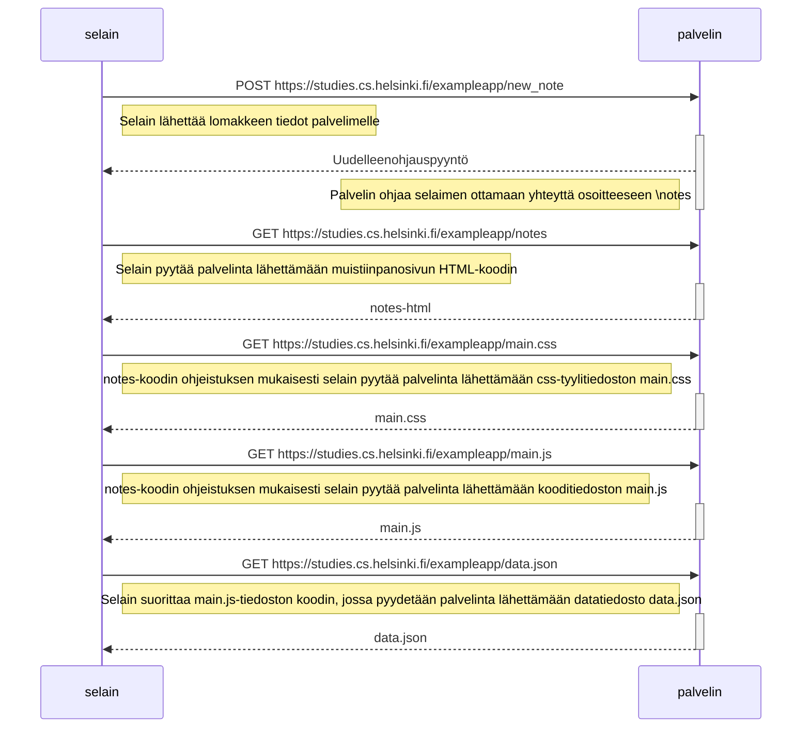

```mermaid
sequenceDiagram
    participant selain
    participant palvelin
    
    selain->>palvelin: POST https://studies.cs.helsinki.fi/exampleapp/new_note
    Note right of selain: Selain lähettää lomakkeen tiedot palvelimelle
    activate palvelin
    palvelin-->>selain: Uudelleenohjauspyyntö
    Note left of palvelin: Palvelin ohjaa selaimen ottamaan yhteyttä osoitteeseen \notes
    deactivate palvelin
    
    selain->>palvelin: GET https://studies.cs.helsinki.fi/exampleapp/notes
    Note right of selain: Selain pyytää palvelinta lähettämään muistiinpanosivun HTML-koodin
    activate palvelin
    palvelin-->>selain: notes-html
    deactivate palvelin
    
    selain->>palvelin: GET https://studies.cs.helsinki.fi/exampleapp/main.css
    Note right of selain: notes-koodin ohjeistuksen mukaisesti selain pyytää palvelinta lähettämään css-tyylitiedoston main.css
    activate palvelin
    palvelin-->>selain: main.css
    deactivate palvelin
    
    selain->>palvelin: GET https://studies.cs.helsinki.fi/exampleapp/main.js
    Note right of selain: notes-koodin ohjeistuksen mukaisesti selain pyytää palvelinta lähettämään kooditiedoston main.js
    activate palvelin
    palvelin-->>selain: main.js
    deactivate palvelin

    selain->>palvelin: GET https://studies.cs.helsinki.fi/exampleapp/data.json
    Note right of selain: Selain suorittaa main.js-tiedoston koodin, jossa pyydetään palvelinta lähettämään datatiedosto data.json
    activate palvelin
    palvelin-->>selain: data.json
    deactivate palvelin
```
