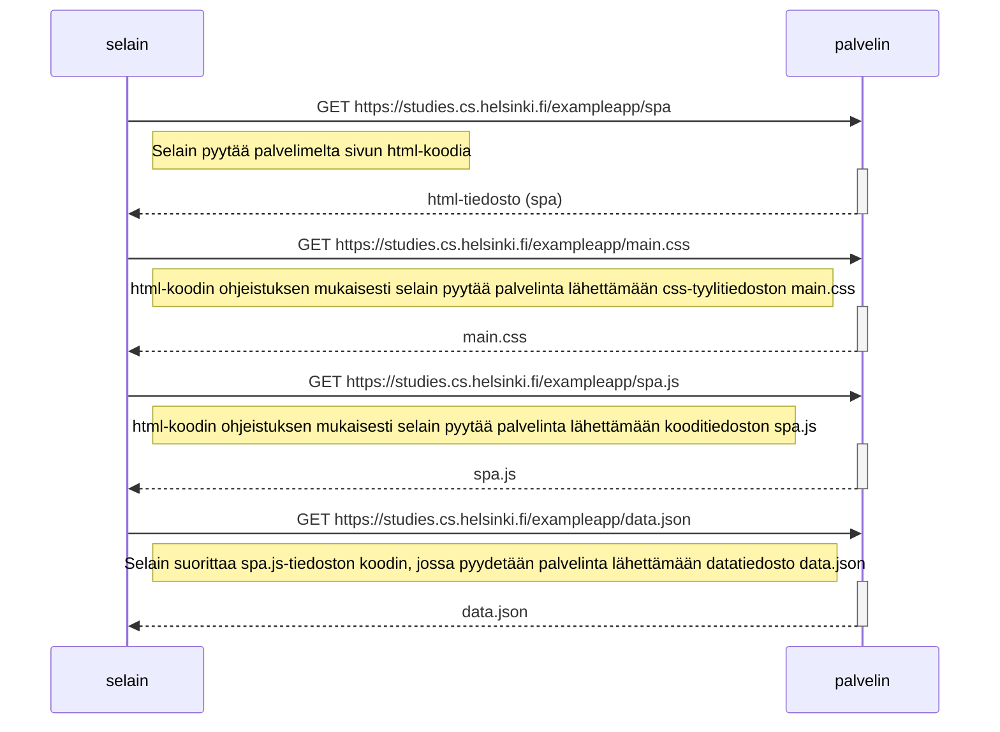

```mermaid
sequenceDiagram
    participant selain
    participant palvelin
    
    selain->>palvelin: GET https://studies.cs.helsinki.fi/exampleapp/spa
    Note right of selain: Selain pyytää palvelimelta sivun html-koodia
    activate palvelin
    palvelin-->>selain: html-tiedosto (spa)
    deactivate palvelin
    
    selain->>palvelin: GET https://studies.cs.helsinki.fi/exampleapp/main.css
    Note right of selain: html-koodin ohjeistuksen mukaisesti selain pyytää palvelinta lähettämään css-tyylitiedoston main.css
    activate palvelin
    palvelin-->>selain: main.css
    deactivate palvelin
    
    selain->>palvelin: GET https://studies.cs.helsinki.fi/exampleapp/spa.js
    Note right of selain: html-koodin ohjeistuksen mukaisesti selain pyytää palvelinta lähettämään kooditiedoston spa.js
    activate palvelin
    palvelin-->>selain: spa.js
    deactivate palvelin

    selain->>palvelin: GET https://studies.cs.helsinki.fi/exampleapp/data.json
    Note right of selain: Selain suorittaa spa.js-tiedoston koodin, jossa pyydetään palvelinta lähettämään datatiedosto data.json
    activate palvelin
    palvelin-->>selain: data.json
    deactivate palvelin
```
