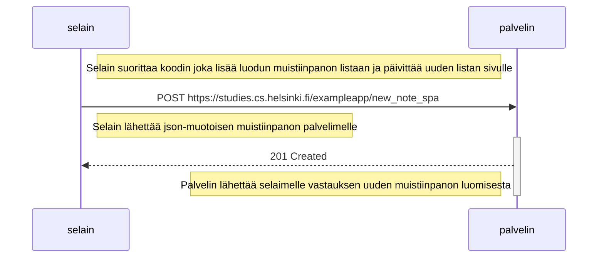

```mermaid
sequenceDiagram
    participant selain
    participant palvelin

    Note right of selain: Selain suorittaa koodin joka lisää luodun muistiinpanon listaan ja päivittää uuden listan sivulle

    selain->>palvelin: POST https://studies.cs.helsinki.fi/exampleapp/new_note_spa
    Note right of selain: Selain lähettää json-muotoisen muistiinpanon palvelimelle
    activate palvelin
    palvelin-->>selain: 201 Created
    Note left of palvelin: Palvelin lähettää selaimelle vastauksen uuden muistiinpanon luomisesta
    deactivate palvelin

    

```
